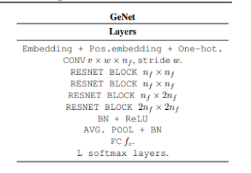
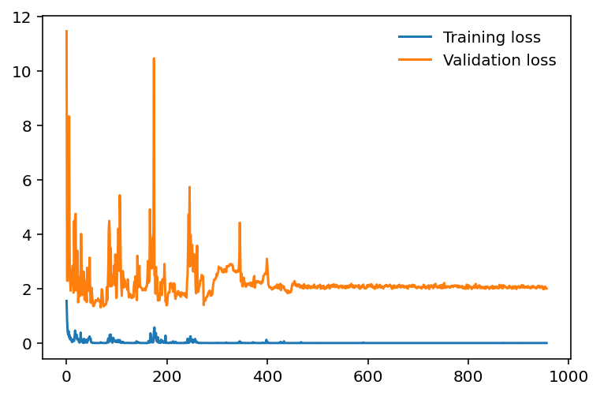
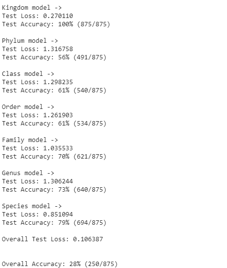

# Metagenomic Classification

It is a research paper based internship project of Bayes Labs based on deep learning for metagenomic classification.

It's link of web app- https://metagenomics-classifier.herokuapp.com/

This project aims to build a inference engine which is a GeNet deep representation for Metagenomics Classification based on this research paper(https://arxiv.org/pdf/1901.11015.pdf) to replace the Kraken and Centrifuge DNA classification methods which
requires large database that makes them unaffordable untransferable and become challenging when the amount of noise in data increases. To counter these problems Deep learning systems is required that can learn from the noise distribution of the input reads.
Moreover, a classification model learns a mapping from input read to class probabilities, and thus does not require a database at run-time. Deep learning systems provide representations of DNA sequences which can be leveraged for downstream tasks.
DNA sequence are also called read which is represented by (G,T,A,C) characters and varies form organism to organism.
Taxonomy is the classification of any organism by this order (Kingdom, Phylum, Class, Order, Family, Genus, Species).
We have to predict the taxonomy by passing read to seven models simultaneously and each models classifies a particular part of above taxa. Combined results of these models helps to classify the read.
There are six kingdoms in biological system -(Plants, Animals, Protists, Fungi, Archaebacteria, Eubacteria)
This project is vast and divided according to the kingdoms as a sub project and each sub project needs eight models taxa+organism name. This report is only on Eubacteria.

## Data Collection

This is the first steps of moving toward project. This project needs a data which has reads and it’s belongs taxonomy.

Data is collected from these resources for each kingdom-
1.NCBI (https://www.ncbi.nlm.nih.gov/) for all kingom.
2.DairyDB(https://github.com/marcomeola/DAIRYdb) for bacteria
3.PlantGDB(http://www.plantgdb.org/) for plants.
4.RVDB(https://rvdb.dbi.udel.edu/) for virus.
5.PlutoF(https://www.gbif.org/dataset/search) for fungi.
6.GreenGene(https://greengenes.secondgenome.com/) for archaea.

All these data are available in FASTA file format which need preprocessing to filter out the required data and stored in a csv file format. 

## Data Preprocessing

After filtering out the required data we have to prepare the balanced train, valid and test CSVs.

Each column of main csv file is considered as the particular model target labels and there are n labels in each columns .

I taked 35 rows of each labels and removed label rows which are less than 35 and truncate the rows of labels which are above 35. I created csv for each labels as row of 35 and put under the particular column folder.

Now I have to prepare train,valid and test csv files. From each label csv I took 20 rows column as train data, 10 rows as a valid data and 5 rows as test data of a particular column.

Above processing will create balanced dataset which helps the model to learn equally for each label. Imbalanced dataset decrease the accuracy.

Data files are in Data folder.

## GeNet: Deep Representations for Metagenomics

Pipelining process of the deep representation for metagenomic 
classification is divided into four parts. For better understanding here is the image below-

Dataset-
Each read is a string of characters (G,T,A,C) varies from organism to organism.

Vector Representation-
Each read’s character is encoded into the numeric data and that list of of numeric data sequence is converted into 2d array.
After that we perform normalization and moved to next step.

Learning Process-
Here GeNet architecture model used for each taxa based on Covolutional Neural Network.

Trained Models-
Here are eight models taxa+name as a combined result.

## GeNet Model Architecture

GeNet, a model for metagenomic classification based on convolutional neural networks. GeNet is trained end-to-end from raw DNA sequences using standard backpropagation with cross-entropy loss.

First layer of model is convolutional 2D neural layer which takes matrix of read as a input.

Resnet Blocks in image are residual block also called ‘skip connections’. They are used to allow gradients to flow through a network directly, without passing through non-linear activation functions. When network depth increase accuracy get saturated and then degrade rapidly to remove that problem 
here we use residual blocks.

Here it’s image below -

Pooling Layers provide an approach to down sampling feature maps by summarizing the presence of features in patches of the feature map. Two common pooling methods are average pooling and max pooling that summarize the average presence of feature and the most activated presence of a feature respectively. Here is the use of average pooling in model.

Batch Normalization layer normalizes each input channel across a mini-batch. To speed up training of convolutional neural networks and reduce the sensitivity to network initialization.

Relu refers to the Rectifier Unit, the most commonly deployed activation function for the outputs of the CNN neurons. It introduced non-linearity in learning process of model which helps it to learn features more efficiently and make it robust.

Relu is simple to compute therefore is faster than sigmoid function and avoids vanishing gradient problem.

## Approach for High Accuracy

I choose the following hyperparameters to which helped me to reach to the average accuracy of 65% of models.

Fully Connected layers is a feed forward neural networks. The input to the fully connected layer is the ouput from the convolutional layers.

I used three FC layers -
Layer 1- {768,384}
Layer 2- {384,768}
Layer 3- {768,total classes}

I used dropout layer after the first two layers and at the end of residual blocks so each model neuron run effectively by stop learning the some neurons at the probability of 20%.

I choose three FC layers with not much variance in the number of neurons to make it deeper to avoid much widening of layers because wide layers memorize the output and not work as a general model for different data. 

Optimizer is an optimization algorithm that is used to update network weights iterative using training data.

Optimizer Algorithms used-
Adam
SGD 

Learning rate is a tuning parameter in an optimization algorithm that deternines the step size at each iteration while moving toward a minimum of a loss function.

I used 0.001 and 0.0001 as a learning rate iteratively. 
Training approach-

Above Graph is showing hikes in graph by at the time of Adam optimizer training the model with learning rate of 0.001.

Above Graph showing the down slope at the time SGD optimizer training the model with learning rate of 0.001

Step 1- I started training with SGD optimizer and learning rate of 0.001 because SGD(Stochastic Gradient Descent) select a few sample from whole data randomly for each iteration due to which it perform many iterations and give time to learn model slowly with 0.001 learning rate helps to move the global minima which is closer to the correct prediction of input.

Step 2-After training with 0.001 learning rate I train it with 0.0001 learning rate to learn more slowly and learn more features and slowly gradient moves toward global minima.

Step 3- In this step I change the SGD optimizer with Adam because which is a combination of RMSprop and Stochastic Gradient Descent with momentum. It uses the squared gradients to scale the learning rate like RMSprop and it takes advantage of momentum by using moving average of the gradient instead of gradient like SGD with momentum.
Adam perform fast convergence than SGD with learning rate of
0.001  moves the model toward global minima.
This steps sometimes increase the accuracy abruptly.

Step 4- Repeat the above step until get the high accuracy. 

Freezing and Unfreezing method improves the accuracy of the model further by 3 to 4%.
I freeze the previous layers of the models and truncate the last classification layer and add new two new FC layer{768,384} and {384,192} with classification layer at last {192,total classes}.

## Models Evaluation

I am using test data set of 875 rows to evaluate the combined result of all models with accuracy.

Here overall accuracy is not going above 28% because of small dataset and number of rows which has all taxas predicted correctly are less. It can only be improved by using large data set and train models again.  

## Inference Output

I take a DNA reads to get the combined result as taxonomy prediction.

'GATGAACGCTGGCGGCGTGCCTAACACATGCAAGTCGAGCGGAGTTTAACTGGAAGCACTTGTGCGACCGGATAAACTTAGCGGCGGACGGGTGAGTAACACGTGAGCAACCTACCTATCGCAGGGGAACAACATTGGGAAACCAGTGCTAATACCGCATAACATCTTTTGGGGGCATCCCCGGAAGATCAAAGGATTTCGATCCGGCGACAGATGGGCTCGCGTCCGATTAGCTAGTTGGTAAGGTAAAAGCTTACCAAGGCAACGATCGGTAGCCGAACTGAGAGGTTGATCGGCCACATTGGGACTGAGACACGGCCCAGGCTCCTACGGGAGGCAGCAGTGGGGAATATTGGGCAATGGGGGAAACCCTGACCCAGCAACGCCGCGTGAAGGAAGAAGGCCTTCGGGTTGTAAACTTCTTTGATCAGGGACGAAACAAATGACGGTACCTGAAGAACAAGTCACGGCTAACTACGTGCCAGCAGCCGCGGTAATACGTAGGTGACAAGCGTTATCCGGATTTACTGGGTGTAAAGGGCGTGTAGGCGGTTTCGTAAGTTGGATGTGAAATTCTCAGGCTTAACCTGAGAGGGTCATCCAAAACTGCAAAACTTGAGTACTGGAGAGGATAGTGGAATTCCTAGTGTAGCGGTAAAATGCGTAGATATTAGGAGGAACACCAGTGGCGAAGGCGACTATCTGGACAGTAACTGACGCTGAGGCGCGAAAGCGTGGGGAGCAAACAGGATTAGATACCCTGGTAGTCCACGCCGTAAACGATGAATACTAGGTGTAGGGGGTATCGACCCCCCCTGTGCCGCAGCTAACGCAATAAGTATTCCACCTGGGGAGTACGACCGCAAGGTTGAAACTCAAAGGAATTGACGGGGGCCCGCACAAGCAGTGGAGTATGTGGTTTAATTCGAAGCAACGCGAAGAACCTTACCAGGGCTTGACATCCTCTGACGGCTGTAGAGATACAGCTTTCCCTTCGGGGACAGAGAGACAGGTGGTGCATGGTTGTCGTCAGCTCGTGTCGTGAGATGTTGGGTTAAGTCCCGCAACGAGCGCAACCCCTATGGTCAGTTGCCAGCACGTAATGGTGGGCACTCTGGCAAGACTGCCGTTGATAAAACGGAGGAAGGTGGGGACGACGTCAAATCATCATGCCCCTTATGTCCTGGGCTACACACGTACTACAATGGCAACAACAGAGGGCAGCCAGGTCGCGAGGCCGAGCGAATCCCAAAATGTTGTCTCAGTTCAGATTGCAGGCTGCAACTCGCCTGCATGAAGTCGGAATTGCTAGTAATGGCAGGTCAGCATACTGCCGTGAATACGTTCCCGGGTCTTGTACACACCGCCCGTCACACCATGAGAGTTTGTAACACCCGAAGTCAGTAGTCTGACCGTAAGGAGGGCGCTGCCGAAGGTGGGACAGATAATTGGGGTG’

All taxas are predicted correctly for above DNA read.

Code is written for Bacteria Kingdom only as a sub project and remaining Kingdoms models can be build according to the above procedure.
